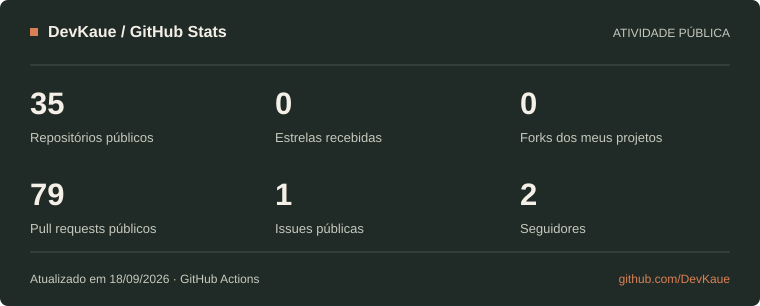

# Olá! Eu sou o Kauê Wendt Sabino 👋

**Engenheiro da Computação · Desenvolvedor Pleno na SpaceIT**

Desde fevereiro de 2026, trabalho na SpaceIT com C# e React na construção de novas soluções. Cuido da arquitetura dos novos projetos e atuo como ponto focal na gestão e liderança deles, conectando regras de negócio, interfaces e infraestrutura.

- 🎓 Formado em **Engenharia da Computação pela Universidade Santa Cecília**.
- 📚 Cursando **pós-graduação em Arquitetura de Software na FIAP — Pós Tech**.
- 🛠️ No dia a dia: **Azure DevOps, Docker, Kubernetes, CI/CD e Clean Architecture**.
- 🌱 Aprofundando estudos em **arquiteturas de software e Raspberry Pi / IoT**.
- 📫 **[E-mail](mailto:kauesabino@hotmail.com)** · **[LinkedIn](https://www.linkedin.com/in/kauewendtsabino/)** · **[Portfólio](https://kaue-wendt-sabino.vercel.app/)**

---

## Tecnologias e ferramentas

**Backend e dados**

**Frontend e mobile**

**DevOps, cloud e qualidade**

**Arquitetura e práticas**

`Clean Architecture` · `DDD` · `SOLID` · `Monólitos modulares` · `APIs REST` · `Modelagem C4` · `ADRs` · `Testes automatizados`

Outras tecnologias com que já trabalhei

C, C++, Assembly, MongoDB, InfluxDB, Express e Entity Framework.

---

## GitHub Stats

Dados públicos, atualizados diariamente pelo GitHub Actions. A data da última atualização aparece no painel.

---

## Projetos em destaque

Uma seleção dos projetos em que estou trabalhando. Os três projetos abaixo têm **código privado**; esta é uma apresentação pública do trabalho.

### 01 · PJ Manager

Aplicação para prestadores de serviço organizarem clientes, projetos, tarefas, horas e faturamento em um só lugar. Inclui relatórios e simulações tributárias.

**Stack:** React · TypeScript · Node.js · Express · PostgreSQL · Docker

### 02 · Dev in English — DevEnglish Daily

Plataforma em desenvolvimento para praticar inglês no contexto de programação, arquitetura de software e comunicação profissional. O MVP local reúne exercícios, histórico de prática e cartões de revisão; as correções ainda são simuladas.

**Stack:** React · Next.js · React Native / Expo · Tauri · Fastify · TypeScript

### 03 · Dashboard Financeiro — DashFinance

Dashboard de finanças pessoais para acompanhar receitas, despesas, cartões, investimentos e reserva de emergência. Inclui modo privacidade, busca, backup e exportação de dados.

**Stack:** React · TypeScript · Node.js · Recharts · Cloudflare Workers / D1

**[Conheça os detalhes no meu portfólio →](https://kaue-wendt-sabino.vercel.app/#projetos)**
